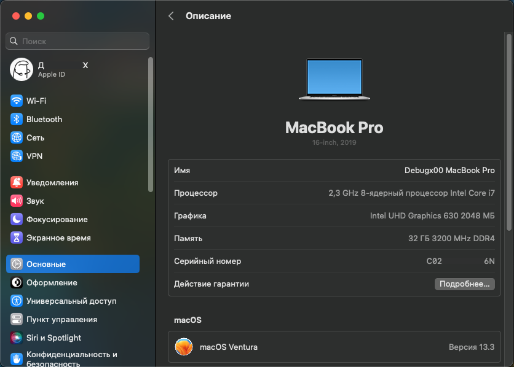
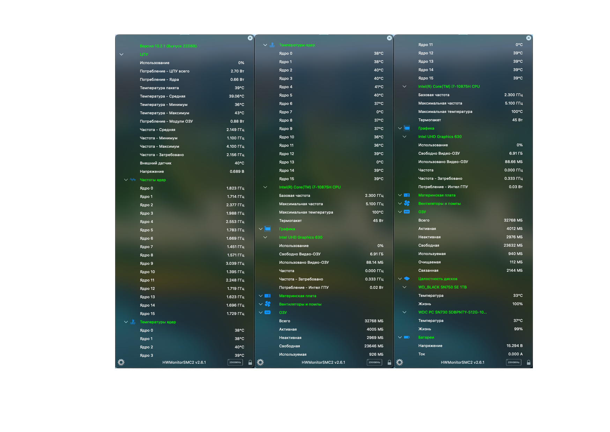

# MSI GE66 10SF-416RU Hackintosh OpenCore 0.9.3 on Comet Lake-H

### ⚠️ Disclaimer | Дисклеймер

### EN:
- "EFI" as it is, it's worth using it as an **example**, don't forget
- The "EFI" may also contain extra garbage
- Read to the end of this page before you start installing anything.
- It is not a fact that "EFI" will be updated with each release of a new version of "OpenCore"
- Perhaps README is not quite complete or I could have forgotten something)))

### RU:
- "EFI" как есть, стоит использовать его как пример, не забывайте
- В "EFI" также может содержаться лишний мусор
- Прочитайте до конца эту страницу прежде чем начать что-то устанавливать.
- Не факт, что "EFI" будет обновляться с каждым выходом новой версии "OpenCore"
- Возможно README не совсем полный или я мог что-то забыть)))
##

### 📸 Screenshots | Скриншоты

<strong>Show/Показать</strong>

 

### 💻 Hardware | Железо

<strong>Show/Показать</strong>

 

| Component                      | Brand/info                                | Extra         |
|--------------------------------|:-----------------------------------------:|:-------------:|
| **Display**                    | `15.6" FHD (1920x1080), 240Hz, IPS-Level` | Used ACPI `SSDT-PNLF` and boot-args `-igfxblr` for fix backlight and `-igfxmpc` for 240Hz|
| **Chipset**                    | `Intel® HM470`                                         |  |
| **CPU**                        | `Intel® Core i7-10875H 2.30GHz up to 5.10GHz`          |  |
| **iGPU**                       | `Intel® UHD Graphics 630`                 | 2048Mb with used key `framebuffer-patch-enable=01000000` and `framebuffer-unifiedmem=00000080 ` |
| **dGPU**                       | `NVIDIA® GeForce RTX™ 2070 with 8GB GDDR6`             | Disabled with ACPI `SSDT-dGPU-Off.aml` |
| **RAM**                        | `Kingston Fury Impact DDR4 2x16Gb 3200mhz`             |  |
| **NVMe SSD #1**                | `NTFS` `WD PC SN730 512GB` (Windows is installed here) | Visible in macOS and available in read-only mode |
| **NVMe SSD #2**                | `NTFS` `WD BLACK SN750 1TB` (Used under Windows)       | Visible in macOS and available in read-only mode |
| **External SSD #3 [USB 3.0]**  | `APFS` `Kingston A400 256GB` (macOS is installed here) |  |
| **WIFI+Bluetooth card**        | `Killer® Wi-Fi 6 AX1650i 160MHz + Bluetooth v5.1` `Intel® AX201NGW`     | Used kexts v2.2.0 `AirportItlwm` `IntelBluetoothFirmware` `BlueToolFixup` |
| **Ethernet**                   | `Intel® Killer E3100 2.5Gbps` `Intel® I225`           | Used kext `AppleIntelI210Ethernet` and boot-args: `e1000=0` |
| **Audio**                      | `Dynaudio 2x2W Speakers` `Realtek ALC298` | Used key in Device Properties `layout-id = 11` |
| **Microphone+Audio jack+**     | `1x Mic-in/Headphone-out Combo Jack`      | Same as in "Audio" |
| **Webcamera**                  | `FHD type (30fps@1080p)`                  | Same as in "I/O Ports" |
| **Keyboard**                   | `Per-Key RGB Keyboard`                    | Used kexts `VooDooPS2Controllers` and same as in "I/O Ports" for Aurora/Per key RGB |
| **Trackpad**                   | `Synaptics`                               | Used ACPI `SSDT-GPI0` and Kexts `VooDooI2C` `VooDooI2CSynaptics` |
| **Battery**                    | `99.99 Wh`                                |  |
| **I/O Ports**                  | `1x Type-C (USB3.2 Gen2 / DP)` `1x Type-C USB3.2 Gen2x2` `2x Type-A USB3.2 Gen1` `1x Type-A USB3.2 Gen2` `1x SD (XC/HC) Card Reader` `1x HDMI™ 2.1 (4K @ 60Hz) HDMI™` `1x Mini-DisplayPort` `1x RJ45` | Used kexts `USBToolBox` and `UTBMap` |
| **BIOS** | `E1541IMS.*0F` | * - 10F or 30F |

### ✅️ What works | Что работает

<strong>Show/Показать</strong>

 

| English                                          | Russian                                       |
|--------------------------------------------------|-----------------------------------------------|
| Intel UHD 630 with acceleration and 2048Mb memory | Intel UHD 630 с ускорением и памятью 2048 МБ |
| Power management | Управление питанием |
| Sleep/Wake-up including from the lid | Сон/Пробуждение в том числе от крышки |
| Audio/Microphone/Audio jack | Звук/Микрофон/Аудио джек |
| Battery percentage | Процент заряда батареи |
| USB ports | USB порты |
| Adjusting the display brightness | Регулировка яркости дисплея |
| WIFI/Bluetooth | WIFI/Bluetooth |
| iServices* | iServices* |
| Dual Boot OS | Двойная загрузка ОС |
| Keyboard with backlight | Клавиатура с подсветкой |
| Trackpad | Трекпад |
| FN keys including brightness and sound adjustment | FN keys включая регулировку яркости и звука |
| Internal webcamera | Встроенная камера |
| Ethernet port RJ-45 | Интернет порт RJ-45 |
| Intel Turbo Boost | Intel Turbo Boost |
| Card reader | Картридер |

`*` - [GenSMBIOS](https://dortania.github.io/OpenCore-Post-Install/universal/iservices.html#using-gensmbios)  
English: You need to generate the data and insert it into the config, the guide on how to do this is indicated under the star  
Russian: Вам нужно сгенерировать данные и подставить их в конфиг, руководство как это сделать указано под звездочкой

### ❌️ What doesn't work | Что не работает

<strong>Show/Показать</strong>

 

| English                                                      | Russian                                                      |
|--------------------------------------------------------------|--------------------------------------------------------------|
| Nvidia RTX 2070 - Disabled because there are no drivers      | Nvidia RTX 2070 Отключена, т.к. нет драйверов           |
| Airdrop (can be fixed with a Broadcom card)                  | Airdrop (может быть исправлен с помощью карты Broadcom) |
| Sidecar Wireless - Use an iPad as a second display for a Mac | Sidecar Wireless - Использование iPad в качестве второго дисплея для компьютера Mac |
| Universal Control - Use a single keyboard and mouse between Mac and iPad | Универсальное управление - использование одной клавиатуры и мыши для работы на компьютере Mac и устройстве iPad |
| Unlock your Mac with your Apple Watch | Авторазблокировка компьютера Mac с помощью часов Apple Watch                   |
| Use Handoff to continue tasks on your other devices | Использование функции Handoff для продолжения выполнения задач на других устройствах |
| HDMI and Display port - because it is connected to discrete graphics from Nvidia | HDMI и Display Port - т.к. он подключен к дискретной графике от  Nvidia |
| DRM - because this requires a supported discrete graphics | DRM - т.к. для этого нужна поддерживаемая дискретная графика |
| Readings from fans | Показания с вентиляторов |

### ⚠️ Not tested | Не протестированно

<strong>Show/Показать</strong>

 

| English                 | Russian                |
|-------------------------|------------------------|
| Video output over USB-C | Видеовыход через USB-C |

### 🫠 Known issues | Известные проблемы

<strong>Show/Показать</strong>

 

| English                                         | Russian                                             |
|-------------------------------------------------|-----------------------------------------------------|
| WIFI may not connect after logging in           | WIFI Может не подключиться после входа в систему    |
| Bluetooth may not connect to devices right away | Bluetooth может не сразу подключаться к устройствам |
| A couple of times it happened that the settings of the trackpad and/or the control center were lost | Пару раз встречалось что сбивались настройки трекпада и/или пункта управления |
| After booting into Windows and then booting into mac OS, the speakers may stop working. To prevent this from happening, after Windows, go to the boot menu, select the disk with the installed mac OS, but do not boot into it, and click turn off from below and wait until the disk indicator goes out (about 10 seconds), then you can boot into macOS, the speakers will work | После загрузки в Windows и последующей загрузки в macOS могут перестать работать динамики. Чтобы такое не происходило, после Windows, зайдите в меню загрузки, выберите диск с установленной macOS, но не загружайтесь в неё, а нажмите снизу выключить и дождитесь пока погаснет индикатор использования диска (примерно 10 сек), затем можете загружаться в macOS, динамики будут работать |

## ⚙️ Setup | Установка

<strong>🔧 BIOS Settings | Настройки BIOS</strong>

 
English: Standard settings, with the exception of Secure Boot
 
 
Russian: Стандартные настройки, за исключением Secure Boot
  
 

| **Hidden BIOS Settings / Скрытые настройки BIOS** | `Right Shift` + `Right Ctrl` + `Left Alt` + `F2` |
|---|---|

| ***Advanced*** | |
|:--|:-:|
| Power & Performance - CPU-Power Management Control - Configure CPU Lock Options - CFG lock | `Enabled` |
| Intel Virtualization Technology | `Enabled` |
| VT-d | `Enabled` |
| System Agent (SA) Configuration - Graphics Configuration - DVMT Pre-Allocated | `64M` |
| USB Configuration - USB Controller | `Enabled` |
| USB Configuration - XHCI Hand-off | `Enabled` |
| USB Configuration - Legacy USB Support | `Auto` |
| Intel(R) Speed Shift Technology | `Enabled` |

| ***Boot*** | |
|:--|---|
| Fast Boot | `Enabled` |

| ***Security*** | |
|:--|---|
| Secure Boot > Secure Boot Support | `Enabled` |

<strong>🗒 config.plist edits</strong>

  
### Generating SMBIOS + Fix iServices:

English: You need to generate the data (Type, Serial, Board Serial, SmUUID, ROM) and insert it into the config, a complete guide on how to do this is indicated under the star 
 
 
Russian: Вам нужно сгенерировать данные (Type, Serial, Board Serial, SmUUID, ROM) и подставить их в конфиг, полное руководство как это сделать указано под звездочкой
 

| | English - Quick Guide | Russian - Краткое руководство |
|---|---|---|
| 1. | [Download GenSMBIOS](https://github.com/corpnewt/GenSMBIOS) | [Скачать GenSMBIOS](https://github.com/corpnewt/GenSMBIOS) |
| 2. | Start GenSMBIOS and select option 1 to download and install MacSerial | Запустите GenSMBIOS и выберите опцию 1, чтобы загрузить и установить MacSerial |
| 3. | Select option 3 and enter `MacBookPro16,1 10` 10 serial numbers will be generated | Выберите опцию 3 и введите `MacBookPro16,1 10` будут сгенерированы 10 шт. серийников |
| 4. | Copy and check Serial: `XXXXXX...` on [Apple page](https://checkcoverage.apple.com/) | Cкопируйте и проверьте Serial: `XXXXX...` на [странице Apple](https://checkcoverage.apple.com/) |
| 5. | If you get a red message saying "Sorry, we can't verify coverage for this serial number." then it's all right! Otherwise, go back to GenSMBIOS and select the next serial number from the previously generated ones | Если вы получите красное сообщение со словами "Извините, мы не можем проверить покрытие для этого серийного номера". тогда все в порядке! В противном случае вернитесь в GenSMBIOS и выберите следующий серийный номер из ранее сгенерированных |
| 6. | Open the config.plist and go to Platforminfo > Generic | Откройте config.plist и перейдите в Platforminfo > Generic |
| 7. | Enter the data corresponding to the desired serial number, where `Type=SystemProductName`, `Serial=SystemSerialNumber`,  `Board Serial=MLB`, `SmUUID=SystemUUID`, `ROM=ROM` | Впишите  данные соответствующие нужному серийному номеру, где `Type=SystemProductName`, `Serial=SystemSerialNumber`,  `Board Serial=MLB`, `SmUUID=SystemUUID`, `ROM=ROM` |
| 8. | Save and reboot | Сохраните и перезагрузитесь |
| **!!!** | **Important: We need an invalid serial number!** | **ВАЖНО: Нам нужен недействительный серийный номер!** |

[GenSMBIOS Complete Guide | Полная Инструкция](https://dortania.github.io/OpenCore-Post-Install/universal/iservices.html#using-gensmbios)  

## 🛠 Post-install | Пост-установка

<strong>Show/Показать</strong>

 
  
| English | Russian |
|---|---|
| Go to utilities, download and install OpenCore Configurator, the first time you will need to open with Ctrl | Перейдите в утилиты, скачайте и установите OpenCore Configurator, первый раз потребуется открытие с Ctrl |
| In the control center, click on OpenCore Configurator and mount the EFI section of the installation flash drive and the EFI section of the disk on which macOS was installed | В пункте управления нажмите на OpenСore Configurator и смонтируйте раздел EFI установочной флешки и раздел EFI диска на который устанавливался macOS |
| Copy EFI folder from the USB flash drive to the disk with the installed macOS | Скопируйте папку EFI с флешки на диск с установленной macOS |
| Unplug installation USB flash drive and restart the laptop, while restarting, hold down the F11 key to access the boot menu | Отключите установочную USB флешку и перезагрузите ноутбук, во время перезагрузки удерживайте нажатой клавишу F11, чтобы получить доступ к меню загрузки |
| In boot menu, select the disk with macOS installed | В меню загрузки выберите диск с установленной macOS |

## ⭐️ Utilities | Утилиты

<strong>Show/Показать</strong>

 

[OpenCore Configurator](https://mackie100projects.altervista.org/download-opencore-configurator/)
 
[Hackintool](https://github.com/benbaker76/Hackintool/releases)
 
[HWMonitorSMC2](https://github.com/CloverHackyColor/HWMonitorSMC2/releases)
 
[PlistEdit Pro](https://www.fatcatsoftware.com/plisteditpro/)
 
[IORegistryExplorer](https://github.com/utopia-team/IORegistryExplorer/releases)
 
[MaciASL](https://github.com/acidanthera/MaciASL/releases)
 
[Intel Power Gadget](https://www.intel.com/content/dam/develop/external/us/en/documents/downloads/intel-power-gadget.dmg)
  

